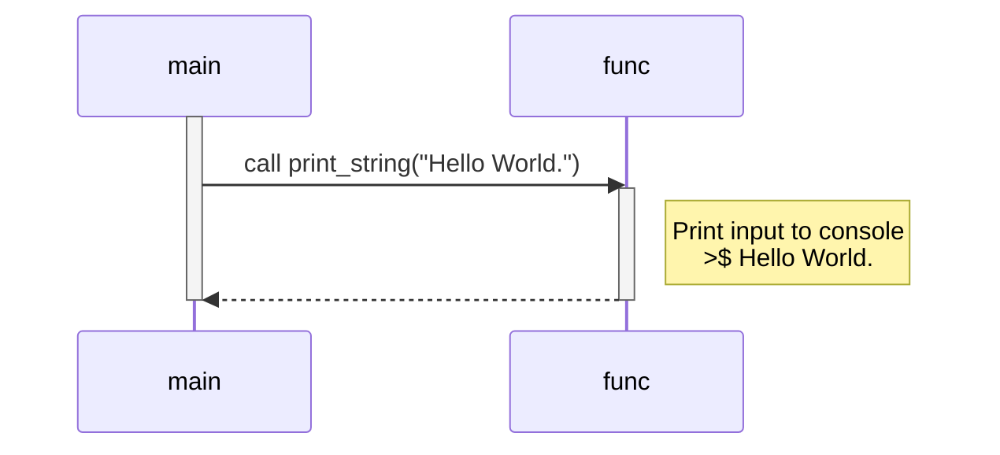

# Bazel Test
This is a simple bazel test.

## Sequence diagram


## Execution result
```shell
$ bazel run //src:hello-world 
INFO: Analyzed target //src:hello-world (0 packages loaded, 0 targets configured).
INFO: Found 1 target...
Target //src:hello-world up-to-date:
  bazel-bin/src/hello-world
INFO: Elapsed time: 0.423s, Critical Path: 0.01s
INFO: 1 process: 1 internal.
INFO: Build completed successfully, 1 total action
INFO: Build completed successfully, 1 total action
Hello World.
```

## Test
```shell
$ bazel test --test_output=all ...
INFO: Analyzed 3 targets (0 packages loaded, 18 targets configured).
INFO: Found 2 targets and 1 test target...
INFO: From Testing //test:hello_test:
==================== Test output for //test:hello_test:
Running main() from gmock_main.cc
[==========] Running 1 test from 1 test suite.
[----------] Global test environment set-up.
[----------] 1 test from FuncTest
[ RUN      ] FuncTest.PrintString
[       OK ] FuncTest.PrintString (1 ms)
[----------] 1 test from FuncTest (1 ms total)

[----------] Global test environment tear-down
[==========] 1 test from 1 test suite ran. (2 ms total)
[  PASSED  ] 1 test.
================================================================================
INFO: Elapsed time: 15.359s, Critical Path: 10.04s
INFO: 24 processes: 3 internal, 21 processwrapper-sandbox.
INFO: Build completed successfully, 24 total actions
//test:hello_test                                                        PASSED in 0.1s

Executed 1 out of 1 test: 1 test passes.
There were tests whose specified size is too big. Use the --test_verbose_timeout_warnings command line option to see which ones 
INFO: Build completed successfully, 24 total actions
```
